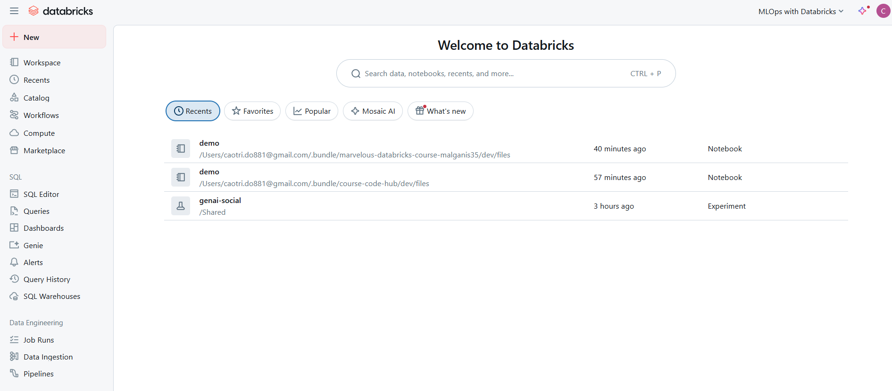

=================
Databricks Setup
=================

:Authors:
    Cao Tri DO <cao-tri.do@keyrus.com>
:Version: 2025-04

.. admonition:: Objectives
    :class: important

    This article is intended to help you to setup your Databricks environment within VS Code.

Setup our Databricks environment
----------------------------------

Access the Databricks workspace
^^^^^^^^^^^^^^^^^^^^^^^^^^^^^^^

URL : https://dbc-c2e8445d-159d.cloud.databricks.com/

The username of the Databricks account is the email address you sent in the registration form.

There is no password, it will send an email with a code to enter to validate your account.

Create the Catalog for your data
^^^^^^^^^^^^^^^^^^^^^^^^^^^^^^^^

1. Go to the Databricks workspace
2. Go to Catalog
3. Go to mlops_dev
4. Go to your schema name (e.g. `caotrido`)
5. Create a new volume (Create > Create Volume)
6. Upload the data files (Create > Upload Files)

Setup your VS Code for Databricks
------------------------------------------------

1. Open your VS Code and install the Databricks extension from the marketplace.

   - Open the extensions tab (Ctrl + Shift + X)
   - Search for Databricks
   - Install the extensions named:

     - Databricks by Databricks
     - Databricks Connect by Databricks
     - Databricks CLI by Databricks
     - Databricks Power Tools by Databricks
   - Restart your VS Code

2. Open the Databricks extension

   - Open the command palette (Ctrl + Shift + P)
   - Type Databricks and select Databricks: Open Databricks
   - Sign in to your Databricks account using the provided link

3. Configure your Databricks workspace

   - Open the command palette (Ctrl + Shift + P)
   - Type Databricks and select Databricks: Configure Databricks
   - Enter your Databricks workspace URL and token

Test your Databricks setup
------------------------------------------------

1. Clone the project repository from the course: https://github.com/end-to-end-mlops-databricks-3/course-code-hub

.. code-block:: bash

   git clone git@github.com:end-to-end-mlops-databricks-3/course-code-hub.git

2. Go to the project folder

.. code-block:: bash

    cd course-code-hub

3. Add the GITHUB_TOKEN environment variable (if you have not done it yet: https://github.com/settings/tokens)

.. code-block:: bash

    export GITHUB_TOKEN=your_github_token

3. Install the environment and the requirements

.. code-block:: bash

    uv venv -p 3.11 .venv
    source .venv/bin/activate
    uv sync --extra dev

4. Open the project folder in VS Code

.. code-block:: bash

    code

5. Check the pyproject.yml file

Replace the following lines:

.. code-block:: yaml

                "marvelous",
                ]

    dynamic = ['version']

    [tool.uv.sources]
    marvelous = {git = "https://${GIT_TOKEN}@github.com/end-to-end-mlops-databricks-3/marvelous.git", rev="0.1.0"}

by this one:

.. code-block:: yaml

                "marvelous@git+https://github.com/end-to-end-mlops-databricks-3/marvelous@0.1.0",
                ]

6. Create a demo file:

.. code-block:: bash

   nano demo.py

and add the following code:

.. code-block:: python

   #%% Databricks notebook source
    from pyspark.sql import SparkSession

    spark = SparkSession.builder.getOrCreate()

    df = spark.read.table("samples.nyctaxi.trips")
    df.show(5)

7. Run the demo file on Databricks. Click on the "Run" button in the top right corner of the editor and select **"Upload and Run on Databricks"** . This will execute the code in the Databricks notebook and display the results in the output panel.
