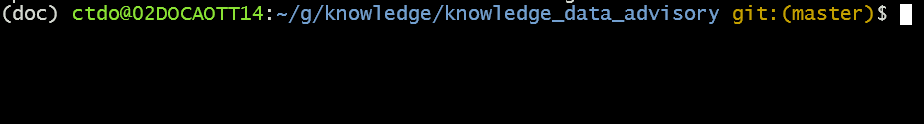
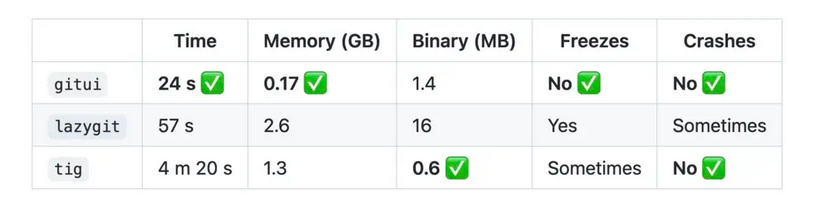

GIT Setup
=========================

:Authors:
    Cao Tri DO <cao-tri.do@keyrus.com>
:Version: 2025-05

.. admonition:: Pre-requiresites

   - You have installed WSL
   - You have installed the minimal Linux setup (packages from apt source)

Reproduce the tree folder from Gitlab
-------------------------------------

Let's duplicate the Github group and propose a structure in your Linux VM:

.. code:: bash

  cd; mkdir -p g/training/{ressources,personal_folder}

By using a ``tree`` command, you should obtain a folder structure like this:

.. code-block:: bash

  .
  └── g
      └── training
          └── ressources
          └── personal_folder

The structure of this Github structure is organized as follow:

- **ressources** : will contain all the standard ressources (template, general packages, etc.)
- **personal_folder** : will contains your projects for the course

Install Git
-------------------------
If you want to install the basic Git tools on Linux via a binary installer, you can generally do so through the package management tool that comes with your distribution.

As usual, first start with an update of your package and then, install git from the command line

.. code:: bash

  sudo apt-get update
  sudo apt install git-all

Now, setup your global name and email address that will appear for your commits:

1. Change **"FIRST_NAME LAST_NAME"** by your name

.. code:: bash

  git config --global user.name "FIRST_NAME LAST_NAME"

2. Change **"MY_NAME@example.com"** by your email address

.. code-block:: bash

   git config --global user.email "MY_NAME@example.com"

(Optional) Git repo name in shell
-------------------------------------------------------------------

source: https://hinty.io/ivictbor/show-git-branch-in-bash-on-linux-windows-wsl-2-cygwin-prompt/

It can be useful from your command line to see if you are in a git repo and on which branch:

To do this, add the following code in your ``~/.bashrc``

.. code-block:: bash

  # Add a display in your command line if you are in a git repo
  parse_git_branch() {
    local branch_name
    branch_name=$(git rev-parse --abbrev-ref HEAD 2> /dev/null)
    if [ -n "$branch_name" ]; then
      echo " git:($branch_name)"
    fi
  }

  PS1='${debian_chroot:+($debian_chroot)}\[\033[01;32m\]\u@\h\[\033[00m\]:\[\033[01;34m\]\w\[\033[00m\]\[\033[33m\]$(parse_git_branch)\[\033[00m\]\$ '

(Optional) Install Gitui
-------------------------
Based on the article: https://korben.info/gitui.html

In general, the inconvenient of graphical interface are:

1/ they are not in the terminal ;

2/ they slow down your user experience.

If you start with git and do not know all the good git command, you can test and use GitUI.

.. image:: git_setup/gitui_demo.gif
   :width: 600px

It is an interface for Git that you can pilot with your keyboard and that works with the terminal.
It is portable, fast, free and open source.
Compared to other packages, it is faster and takes less memory.

To install GitUI

.. tab:: with Snap

  1. Install snap

  .. code-block:: bash

    sudo apt update
    sudo apt install snapd

  2. Install gitui

  .. code-block:: bash

    sudo snap install gitui

.. tab:: old installation (not functional anymore)

  .. code:: bash

    curl -s curl -s https://api.github.com/repos/extrawurst/gitui/releases/latest | grep -wo "https.*linux.*gz" | wget -qi -
    tar xzvf gitui-linux-x86_64.tar.gz
    rm gitui-linux-x86_64.tar.gz
    sudo chmod +x gitui
    sudo mv gitui /usr/local/bin

Then to test it, you can create a new repo, go into it and init a git repo:

.. code-block:: bash

  # create a repo for test
  mkdir test_git
  # go into the repo
  cd test_git/
  # init the git repo
  git init

You should normally see something like this:

Now if you type the command ``gitui``, you should obtain this:

.. image:: git_setup/gitui_demo.gif
   :width: 600px
