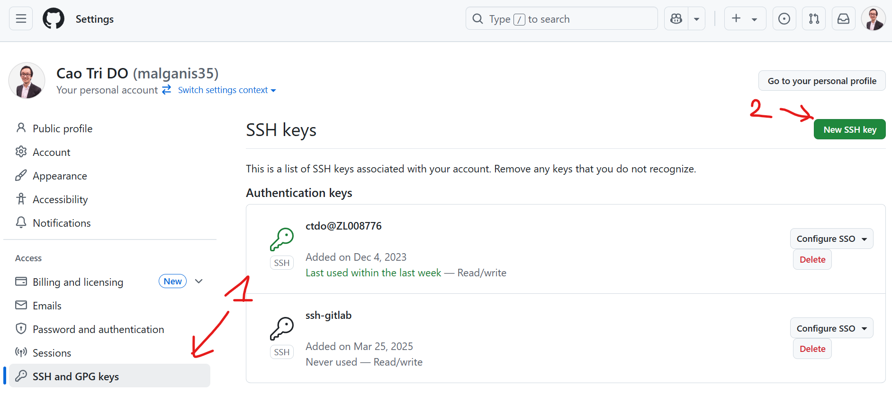

=========================
SSH & Github Setup
=========================

:Authors:
    Cao Tri DO <cao-tri.do@keyrus.com>
:Version: 2025-05

.. admonition:: Prerequisite
   :class: hint

   Check you have access to the Github of the course `Github Marvelous <https://github.com/end-to-end-mlops-databricks-3>`__
   
   If not, please contact Maria or Basak.

Setup your SSH keys
===================

Configure ``ssh`` and your keys:

.. tab:: Generate your own SSH keys

  You can generate your own SSH keys (private and public) using this command

  .. code:: bash

    ssh-keygen

  You then, will be prompt to:

  - Give a name to our SSH key file (by default, ``id_rsa``). We advice to put your email address (*i.e*, ``cao-tri.do@keyrus.com``)
  - Put a passphrase (password) for your private key. This is optional but recommended. We recommend that you put your linux password to easy remember it.

  You should normally see this screen:

  .. image:: git_setup/ssh-keygen.png

.. tab:: SSH keys are given

  .. warning::

      - Use as SSH keys the one provided by the DevOps team.
      - They will provide you with a zip file e.g. ``cao-tri.do@keyrus.com.zip`` with
        both your public and private key, copy them in your Windows Documents folder.

        Please save the zip file in your Windows Documents folder. 

  .. note::

    We can access the Windows filesystem from the Linux VM::

      ctdo@W11DOFAVIER:~$ df -h /mnt/c
      Sys. de fichiers Taille Utilisé Dispo Uti% Monté sur
      C:\                376G     62G  315G  17% /mnt/c

  Unzip the zip file in an ``.ssh`` folder directly from the ``.ssh`` folder, (example
  below with ctdo's account):

  .. code:: bash

      ctdo@W11DOFAVIER:~$ cd
      ctdo@W11DOFAVIER:~$ mkdir .ssh
      ctdo@W11DOFAVIER:~$ cd .ssh
      ctdo@W11DOFAVIER:~/.ssh$ unzip /mnt/c/Users/ctdo/Documents/cao-tri.do@keyrus.com.zip
      Archive:  /mnt/c/Users/ctdo/Documents/cao-tri.do@keyrus.com.zip
        inflating: cao-tri.do@keyrus.com
        inflating: cao-tri.do@keyrus.com.pub
      ctdo@W11DOFAVIER:~/.ssh$ rm
      /mnt/c/Users/ctdo/Documents/cao-tri.do@keyrus.com.zip

Now both public and private keys are on your ``~/.ssh`` folder.

(optional) Add a symlink to the default ssh filename ``id_rsa`` to inform SSH about your default
account:

.. code:: bash

  ln -s ~/.ssh/cao-tri.do@keyrus.com ~/.ssh/id_rsa

To inform ``ssh`` about the gitlab, create an ``.ssh/config`` file with the following:

.. code:: bash

  nano .ssh/config

Copy the following lines in the ``config`` file and replace ``cao-tri.do@keyrus.com`` by your ``ssh`` private keyfile

.. code:: bash

    AddKeysToAgent yes

    host *
      ForwardAgent yes
      GSSAPIAuthentication no
      ServerAliveInterval 15
      IdentityFile ~/.ssh/cao-tri.do@keyrus.com

.. note::
  In the config file above, by default, for all host, your private generated key will be used.
  For a new host, add new line like above. You will be able to define a specific ``ssh`` private key 
  by using the line: ``IdentityFile ~/.ssh/my_private_key``

(Recommended) SSH Agent
=======================

Based on: https://kb.iu.edu/d/aeww

To avoid typing each time you push or fetch from Gitlab, you can use a SSH Agent.

In Unix, **ssh-agent** is a background program that handles passwords for SSH private keys. 
The **ssh-add** command prompts the user for a private key password and adds it to the list maintained by **ssh-agent**.
Once you add a password to **ssh-agent**, you will not be prompted for it when using SSH or 
scp to connect to hosts with your public key.

The public part of the key loaded into the agent must be put on the target system in ``~/.ssh/authorized_keys``; 
see Set up SSH public key authentication to connect to a remote system.

To use **ssh-agent** and **ssh-add**, at the Unix prompt, enter: 

.. code:: bash

  eval `ssh-agent`
  ssh-add .ssh/cao-tri.do@keyrus.com

Make sure you use the backquote (`), located under the tilde (~), rather than the single quote (')

The code below allows for an SSH key to only have to be inputted once in order to use Git Push, Git Pull or similar.

.. tab:: Simple agent

  .. code-block:: shell

    eval `ssh-agent`
    ssh-add .ssh/cao-tri.do@keyrus.com
  
.. tab:: Advanced agent

  .. code-block:: shell

    env=~/.ssh/agent.env

    agent_load_env () { test -f "$env" && . "$env" >| /dev/null ; }

    agent_start () {
      (umask 077; ssh-agent >| "$env")
      . "$env" >| /dev/null ; }

    agent_load_env

    # agent_run_state: 0=agent running w/ key; 1=agent w/o key; 2=agent not running
    agent_run_state=$(ssh-add -l >| /dev/null 2>&1; echo $?)

    if [ ! "$SSH_AUTH_SOCK" ] || [ $agent_run_state = 2 ]; then
      agent_start
      ssh-add
    elif [ "$SSH_AUTH_SOCK" ] && [ $agent_run_state = 1 ]; then
      ssh-add
    fi

    unset env

You just need to add this code in your .profile or .bashrc (don’t forget to do source ~/.bashrc after).   

Solving SSH issues
==================

Based on: https://stackoverflow.com/questions/9270734/ssh-permissions-are-too-open

If you get an error like:

.. code:: bash

  Permissions 0777 for '/Users/username/.ssh/id_rsa' are too open.
  It is recommended that your private key files are NOT accessible by others.
  This private key will be ignored.

Then you need to change the permission of your private SSH key

.. code:: bash

  chmod 600 ~/.ssh/id_rsa

and also for your public SSH key

.. code:: bash

  chmod 600 ~/.ssh/id_rsa.pub

Login Github
=========================

Login Github with your user and password

Go then to the organization page of the course:

Now we want to  be able to retrieve code from and push our production to Github. This
requires that Github authorizes you to do so from your Linux terminal. Your SSH keys will
help.

Configure Github with your ssh keys
========================================
Provide your ssh **public** key into your Github account.

.. tab:: Gitlab SSH keys

   Go to this URL: https://github.com/settings/profile

   |gitlab_set_ssh_key|

   Step_1, Step_2, Step_3 are describe in the image above

.. tab:: cat ssh public key

  From your Linux get your SSH pub key

  For Step_4 please get the content of ~/.ssh/your_pub_key.pub with ``cat``::

     >> cat ~/.ssh/cao-tri.do@keyrus.com
     ssh-rsa AAAAB3NzaC1yc2EAAAADAQABAAACAQCtEFiagtxuIcNkcm39ZB81 ... bPCX7JsYvSivK4hl
     cASQ== cao-tri.do@keyrus.com

  .. image:: /docs/empty.png
     :width: 200px

.. tab:: Add

   below, cut and past the SSH public key to the form and click to "Add"

   |gitlab_add_ssh_key|

.. tab:: Added

   Your key has been added in your Gitlab profile

   |gitlab_ssh_key_done|

---

Test it:

.. code::

   >> ssh git@github.com

If it is the first time, you should obtain this message: Answer it with 'yes'

The very first time you SSH the host, a check is done, please answer **yes** lowercase
to the question:

   ``Are you sure you want to continue connecting (yes/no/[fingerprint])?`` **yes**

Next time, Github will just say Welcome, your SSH keys are working fine:

.. code::

   The authenticity of host '52.169.52.102 (52.169.52.102)' can't be established.
   ED25519 key fingerprint is SHA256:JDEydp97Lz9ivsPmvJBu4wWa0gBa2dyh2+D8Bhf/JD0.
   This key is not known by any other names
   >> Are you sure you want to continue connecting (yes/no/[fingerprint])? yes
   Warning: Permanently added '52.169.52.102' (ED25519) to the list of known hosts.

And then, you obtain:

.. code:: bash
   
    PTY allocation request failed on channel 0
    Hi malganis35! You've successfully authenticated, but GitHub does not provide shell access.
    Connection to github.com closed.
