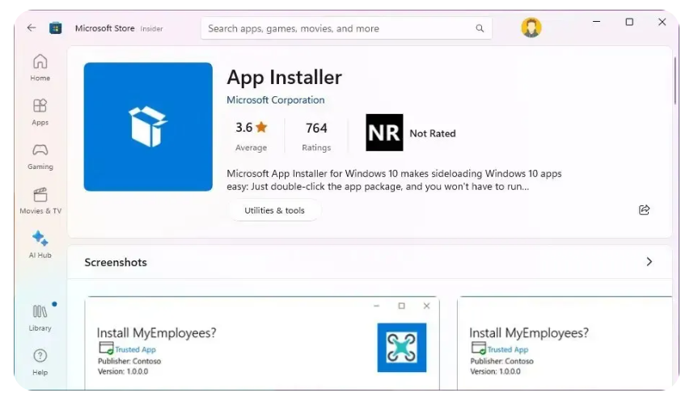

Windows Laptop Setup
=========================

:Authors:
    Cao Tri DO <cao-tri.do@keyrus.com>
:Version: 2025-05

.. note::
   You have received a PC with Windows 11 installed on it.
   The objective of this 1st tutorial is to installed all the software you will need on your windows laptop

Winget
------
We will use the powershell command line with the ``winget`` command to install all the necessary packages.

First, install or update Winget (source: https://thewindowsclub.blog/fr/how-to-install-winget-on-windows-11-10/):

1. Go into the Microsoft Store
2. Search ``App installer``
3. Cliquez on Install or Update

4. Open a Powershell Terminal
5. You will need to update the url of the app source for Microsoft:

.. code-block:: shell

   Add-AppxPackage -Path https://cdn.winget.microsoft.com/cache/source.msix

6. Download this file `packages.json <https://gitlab.com/do-favier/infra/linux-setup/-/raw/main/winget/packages.json?ref_type=heads&inline=false>`_
on your computer

7. Open a Powershell terminal in the folder where you store the previous file

8. You can install all the software contains in ``packages.json`` by using this command line:

.. code-block:: shell

   winget import .\packages.json

.. note::
   You can alternatively export all your powershell packages installed with winget by using:

   .. code-block:: shell
   
      winget export -o packages.json -s winget

9. We strongly recommend to reboot your PC

(FYI) List of software that will be installed
---------------------------------------------

.. tab:: Bureautique

  - Office 365 all softwares (Outlook, Teams, PowerPoint, Excel, Word)
  - Notepadd++
  - Chrome, Firefox, Edge
  - Bitwarden
  - 7zip
  - Foxit Reader / Acrobat Reader
  - XMind
  - PowerToys
  - Slack
  - Zoom

.. tab:: Bureautique (Winget)

    .. code::

        winget install -e --id Notepad++.Notepad++

        $Path = $env:TEMP; $Installer = 'chrome_installer.exe'; Invoke-WebRequest -Uri 'http://dl.google.com/chrome/install/375.126/chrome_installer.exe' -OutFile $Path\$Installer; Start-Process -FilePath $Path\$Installer -Args '/silent /install' -Verb RunAs -Wait; Remove-Item -Path $Path\$Installer

        winget install -e --id Mozilla.Firefox

        winget install --id=7zip.7zip  -e

        winget install --id=Foxit.FoxitReader  -e

        winget install -e --id Adobe.Acrobat.Reader.32-bit

        winget install -e --id Microsoft.PowerToys

        winget install -e --id SlackTechnologies.Slack

        winget install -e --id Zoom.Zoom

        winget install -e --id voidtools.Everything

        winget install --id=Piriform.CCleaner -e

.. tab:: Coding

  - WSL
  - Windows Terminal
  - Python
  - Anaconda
  - MobaXterm
  - Putty
  - Git
  - TortoiseGit
  - VS Code
  - Gitui

.. tab:: Coding (Winget)
    
    .. code::

        winget install -e --id Microsoft.WindowsTerminal

        winget install -e --id Microsoft.VisualStudioCode

        winget install --id=Mobatek.MobaXterm  -e

        winget install -e --id PuTTY.PuTTY

.. tab:: Data Analyst
   
  - Power BI
  - Power BI External Tools
  - Just Color Picker
  - Alteryx
  - Knime
  - Tableau Software 

.. tab:: Data Analyst (Winget)
    
    .. code-block:: bash
    
        winget install -e --id Microsoft.PowerBI

        winget install -e --id Tableau.Desktop

Tips & Tricks on Bug
--------------------

If you encounter any issue, you can use the command:

.. code-block:: bash

   winget source reset --force

