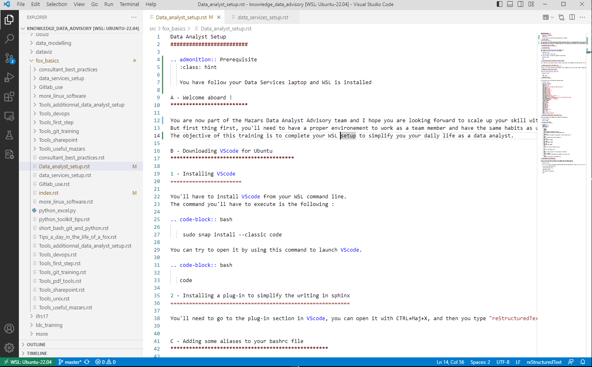
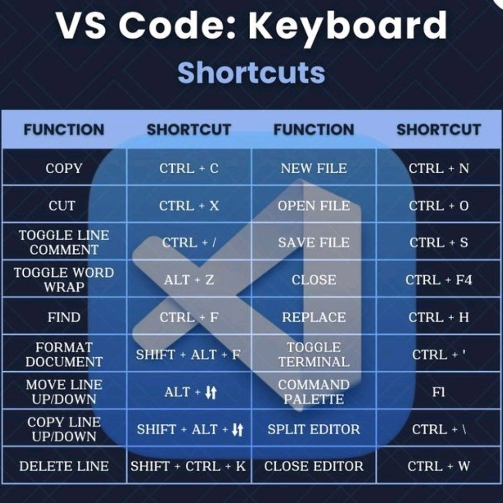
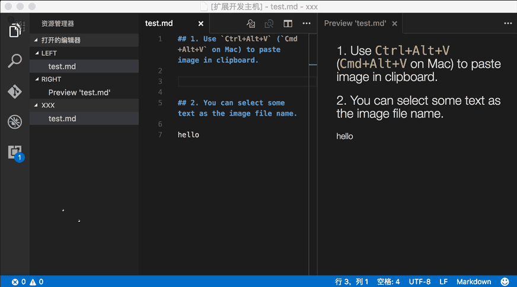

=============
VS Code setup
=============

:Authors:
    Cao Tri DO <cao-tri.do@keyrus.com>
:Version: 2025-04

Install VScode for WSL
=============================

Presentation
----------------

VS Code is a software that can be installed without admin rights.
It offers a large range of useful functionalities to work within Data Services:

- Have an IDE to edit files
- Install extensions to easy you life within the team. For example, writing of Sphinx documentation (RST)
- Execute Jupyter Notebook

.. warning::
   Do not install VS Code within Windows. Everything will be done from your WSL command line

Installing VScode
---------------------

We will be using VS Code directly connected to our WSL instance. For this:

1. Install VS Code in Windows (https://code.visualstudio.com/). For a weird reason, it is the best way to avoid issues on WSL console.

2. Open WSL and launch VScode. This should be downloading VS Code Server on WSL to connect it to your VS Code

.. code-block:: bash

   code

3. (Recommended) Alternatively, you can add this alias to your `.bashrc` file.
It will allow to open VS Code using the current folder:

.. code-block:: bash

   alias code='code --remote wsl+ubuntu "$(pwd)"'

VS Code DS shortcut
==========================

Source:

- https://gist.github.com/bradtraversy/b28a0a361880141af928ada800a671d9
- Cheat Sheet : https://code.visualstudio.com/shortcuts/keyboard-shortcuts-windows.pdf
- https://www.linkedin.com/feed/update/urn:li:activity:7316301593975390208/

Summary of the most useful shortcuts
------------------------------------

When I first started using VS Code, I spent more time clicking than coding.

But once I got the hang of these keyboard shortcuts, my workflow leveled up — big time!

𝐇𝐞𝐫𝐞 𝐚𝐫𝐞 𝐬𝐨𝐦𝐞 𝐨𝐟 𝐦𝐲 𝐟𝐚𝐯𝐨𝐫𝐢𝐭𝐞 𝐕𝐒 𝐂𝐨𝐝𝐞 𝐬𝐡𝐨𝐫𝐭𝐜𝐮𝐭𝐬 𝐭𝐡𝐚𝐭 𝐜𝐚𝐧 𝐛𝐨𝐨𝐬𝐭 𝐲𝐨𝐮𝐫 𝐩𝐫𝐨𝐝𝐮𝐜𝐭𝐢𝐯𝐢𝐭𝐲:

- Toggle Line Comment → Ctrl + /
- Format Document → Shift + Alt + F
- Move Line Up/Down → Alt + ↑ / ↓
- Split Editor → Ctrl + \
- Toggle Terminal → Ctrl + '
- Find → Ctrl + F
- And of course... Save → Ctrl + S (because Ctrl + S is life!)

Whether you're a beginner or a pro dev, these little tricks can save you HOURS.

AI Coding Assistant Shortcuts (Continue)
----------------------------------------

.. list-table::
   :widths: 20 30 30
   :header-rows: 1
   :class: custom-table

   * - **Shortcut**
     - **Description**
     - **Comment**
   * - CTRL + L
     - Open Continue AI Coding Assistant
     -
   * - CTRL + I
     - Open Continue AI Coding Assistant (Inline code)
     -

Open / View
-----------

.. list-table::
   :widths: 20 30 30
   :header-rows: 1
   :class: custom-table

   * - **Shortcut**
     - **Description**
     - **Comment**

   * - CTRL + P
     - Quick file open
     -
   * - CTRL + Shift + P
     - Open Command Palette
     -
   * - CTRL + Shift + E
     - Sidebar Focus
     -
   * - CTRL + B
     - Toggle Sidebar
     -
   * - CTRL + W
     - Close file
     -

Working with files
------------------

.. list-table::
   :widths: 20 30 30
   :header-rows: 1
   :class: custom-table

   * - CTRL + H
     - Find and Replace
     - You can then select a line of text and Click the "Find in selection" icon to the right **Alt + L** or ⌘ L on macOS)
   * - CTRL + ,
     - Open Settings
     -

Code Editing
------------

.. list-table::
   :widths: 20 30 30
   :header-rows: 1
   :class: custom-table

   * - **Shortcut**
     - **Description**
     - **Comment**
   * - CTRL + Left or Right
     - Move by words
     -
   * - CTRL + Home or End
     - Go to beginning or end of file
     -
   * - Alt + Up or Down
     - Move Line Up & Down
     -
   * - Shift + Alt + Up or Down
     - Copy Line Up & Down
     -
   * - CTRL + Enter
     - Insert Line
     -
   * - CTRL + /
     - Comment a line
     -
   * - Shift+Alt+A
     - Add Block Comment
     -
   * - CTRL + D
     - Select Next Match
     -
   * - CTRL + K then CTRL + U
     - Comment out the highlighted section or the line
     -
   * - CTRL + ^
     - Indent
     -
   * - CTRL + )
     - Outdent
     -

Keyrus VS Code Plugins
======================

Our plugins list
----------------

S Tier (Must Have)
^^^^^^^^^^^^^^^^^^

- reStructuredText
- Paste Image from local pc
- Continue
- Python Indent
- AutoDocstring - Python Docstring Generator
- Code Spell Checker
- Data Wrangler
- IntelliCode
- IntelliCode API Usage Examples
- Pylance
- Python
- Python Debugger
- Python Environment Manager
- Python Extension Pack
- Ruff

A Tier (Nice to Have)
^^^^^^^^^^^^^^^^^^^^^

- Comment Translate
- Docker
- Jupyter
- Jupyter Cell Tags
- Jupyter Notebook Renderers
- Jupyter Slide Show
- Makefile Tools
- Rainbow CSV
- Webview

Installing a plug-in to simplify the writing in sphinx
------------------------------------------------------

You'll need to go to the plug-in section in VScode, you can open it with CTRL+Maj+X, and then you type "reStructuredText" in the search bar and you install it.

Procedure to install an extension (example with reStructuredText)

.. tab:: Access to Extension

  Click on the left to the extension (CTRL+Maj+X)

  .. image:: vscode_setup/vscode_extension.PNG
      :width: 600px
      :align: center

.. tab:: Install Extension

  Find the extension in the market place: **reStructuredText** by TatsuyaNakamori

  .. image:: vscode_setup/vscode_restructuredtext.PNG
      :width: 800px
      :align: center

Connect WSL to a remote linux machine
-------------------------------------

If you use a Linux server (for example Oracle Cloud), to setup your WSL:

1. Go into your windows explorer to: ``C:\Users\cao-tri.do\.ssh``
2. Copy your ssh key here
3. Go into the ``config`` file and add this line to your file (change the host, IdentityFile, HostName, User)

.. code-block:: bash

   Host srv002.astraviz.fr
      IdentityFile C:/Users/cao-tri.do/.ssh/ssh-key-2023-08-02.key
      HostName srv002.astraviz.fr
      User ubuntu

4. Go into VS Code
5. Select: "Connect to Host"
6. Select: "Add new ssh host". Enter the ssh
7. Alternatively, you will be able to open the remote explorer file from VS Code

Paste Images from Clipboard
---------------------------

Paste image directly from clipboard to markdown/asciidoc(or other file)!

