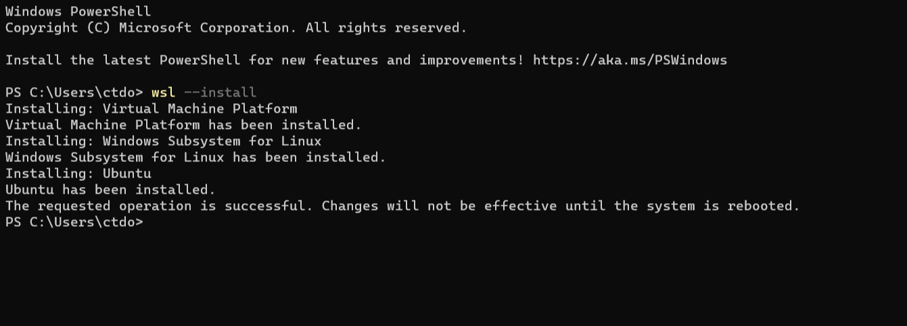

WSL Setup
=========================

:Authors:
    Cao Tri DO <cao-tri.do@keyrus.com>
:Version: 2025-05

.. admonition:: Pre-requiresites

   - You have a laptop in Windows 10 or Windows 11
   - You will need the **admin rights** on your machine to do this.

Install Software
-----------------

We use `(Windows Subsystem for Linux) WSL2 <https://learn.microsoft.com/en-us/windows/wsl/about>`__ to provide a Linux on top of Windows.
The general stack for WSL2 contains:

1. Virtual Machine Plateform for Windows
2. WSL
3. Linux pinguin
4. Ubuntu
5. Gui App

Install with Windows Store (Keyrus Laptop)
^^^^^^^^^^^^^^^^^^^^^^^^^^^^^^^^^^^^^^^^^^

1. On Keyrus Laptop, it is easier to use the Microsoft Store to install the different applications.
Go into the **Microsoft Store** and install:

- WSL
- Ubuntu
- Windows Terminal

.. tab:: WSL

   MS Store Link: https://www.microsoft.com/store/productId/9P9TQF7MRM4R?ocid=pdpshare

   .. image:: laptop_setup/wsl.png
      :width: 600px

.. tab:: Ubuntu

   MS Store Link: https://www.microsoft.com/store/productId/9PN20MSR04DW?ocid=pdpshare

   .. image:: laptop_setup/ubuntu.png
      :width: 600px

.. tab:: Windows Terminal

   MS Store Link: https://www.microsoft.com/store/productId/9N8G5RFZ9XK3?ocid=pdpshare

   .. image:: laptop_setup/windows_terminal.png
      :width: 600px

2. Alternatively, go to the website of VS Code (https://code.visualstudio.com/). Download it and install it manually

Windows 11 with admin rights (not Keyrus Laptop)
^^^^^^^^^^^^^^^^^^^^^^^^^^^^^^^^^^^^^^^^^^^^^^^^

If you have Windows 11, you can install all of these components by opening a Powershell windows and use:

.. code-block:: shell

   wsl --install

You should normally see this:

We strongly recommend that you reboot your laptop.

.. note::
   For older version of Windows, you can follow the instruction in this video: https://www.youtube.com/embed/CouuH3W6ZtA?si=nVgKC3V30nZ7eQCP

In case of errors
^^^^^^^^^^^^^^^^^

Some common errors you might encounter

.. tab:: Hyper-V not activated

   If Hyper-V is not activated, you can activate it in Powershell:

   .. code-block:: bash

      Enable-WindowsOptionalFeature -Online -FeatureName Microsoft-Hyper-V-All

.. tab:: WSL not activated

   If WSL is not activated, you can activate it in Powershell:

   .. code-block:: bash

      Enable-WindowsOptionalFeature -Online -FeatureName Microsoft-Windows-Subsystem-Linux

.. tab:: Conflict WSL 1/2

   If the 2 solutions before does not work, it might be a conflict between an installation of both WSL version 1 and WSL version 2
   Open a Powershell command line

   0 - First uninstall all the distribution installed on your PC

   1- Set the WSL default version to 1

   .. code-block:: bash

      wsl --set-default-version 1

   2- Install Ubuntu distribution

   .. code-block:: bash

      wsl.exe --install Ubuntu

   3- Set the WSL default version back to version 2

   .. code-block:: bash

      wsl --set-default-version 2

.. tab:: Failure of WSL register distribution (ERROR: 0x8004032d)

   If WSL register distribution fails, you can fix it in Powershell:

   .. code-block:: bash

      dism.exe /online /enable-feature /featurename:VirtualMachinePlatform /all /norestart

Create your linux user
----------------------
Very first **Ubuntu terminal** run will provide a screen to create your linux user:

.. important::

   - use your lowercase firstname as login e.g. ``ctdo``
   - use a simple **password** as password (you will use it quite oftenly)

Run Ubuntu Terminal and create your user::

   $ user name: ctdo
   $ password:
   user ctdo has been created

.. |open_ubuntu| image:: /docs/setup_your_pc/wsl_setup/Ubuntu.png
   :width: 430px
.. |fixme_image| image:: /docs/empty.png
   :width: 430px

Update and upgrade your linux packages
--------------------------------------

First thing, we recommand to update / upgrade all your linux packages:

.. code-block:: shell

   sudo apt-get update
   sudo apt-get upgrade

And install all the basics packages used within the team:

.. code:: bash

    sudo apt-get install unzip zip 7zip unrar pigz gzip terminator
    sudo apt-get install curl wget htop gdu tree git tig imagemagick
    sudo apt-get install black jsbeautifier jq tidy pandoc texlive-extra-utils

.. note::
   source: https://askubuntu.com/questions/91543/apt-get-update-fails-to-fetch-files-temporary-failure-resolving-error

   **apt-get update fails to fetch files, “Temporary failure resolving …” error**

   If you encounter any slow issue when updating your package, this might be a problem of your DNS.
   You can easily fix this by executing this command line:

   .. code-block:: bash

      echo "nameserver 8.8.8.8" | sudo tee /etc/resolv.conf > /dev/null

   ``8.8.8.8`` is Google's own DNS server.

   Alternatively, you can add this to your ``.bashrc`` to automatically launch it when starting the command line

Install Windows Terminal
------------------------

.. image:: /docs/setup_your_pc/wsl_setup/windows_terminal.png
   :width: 500px

The windows terminal is an alternative to classic  linux console or terminator.
Developped by Microsoft, it offers a reliable/flexible way to work with WSL.

**Installation**

.. tab:: Windows Store

   MS Store Link: https://www.microsoft.com/store/productId/9N8G5RFZ9XK3?ocid=pdpshare

   .. image:: laptop_setup/windows_terminal.png
      :width: 600px

.. tab:: Manual installation

   **1)** Download Windows Terminal software from github: https://github.com/microsoft/terminal/releases/tag/v1.18.3181.0

   **2)** Launch **Windows Powershell**

   **3)** In powershell, write the following command:

   .. code::

      Add-AppxPackage -Path

   Next, the easiest method is to drag and drop the .msixbundle file (the one downloaded in step 1) into the powersell window. So
   then the path is automatically adjusted.

   .. note::

      If the installation failed, you might need to install VClib package. To do so, just
      download the sofware :download:`here</_static/wsl_setup/Microsoft.VCLibs.x64.14.00.Desktop.appx>`
      and apply the same procedure as with windows terminal msixbundle

To setup your Windows Terminal, you can either import our automatic setup or do it manually

.. tab:: Automatic setup

   Open a Powershell terminal and copy/paste these command lines:

   .. code:: bash

      # Create a folder for installation
      mkdir tmp
      # Go to folder
      cd tmp
      # Download the necessary ressources
      wget "https://gitlab.com/do-favier/infra/linux-setup/-/archive/main/linux-setup-main.zip?path=windows_terminal" -outfile "wsl.zip"
      # Unzip the files
      Expand-Archive "wsl.zip"
      # Go to the folder
      cd wsl\linux-setup-main-windows_terminal\windows_terminal
      # Put .wslconfig in %UserProfile%
      Copy-Item -Path .\.wslconfig -Destination "$env:UserProfile"
      # Put settings.json in %LocalAppData%\Packages\Microsoft.WindowsTerminal_8wekyb3d8bbwe\LocalState
      Copy-Item -Path .\settings.json -Destination "$env:LocalAppData\Packages\Microsoft.WindowsTerminal_8wekyb3d8bbwe\LocalState"

   At the end you can delete the ``tmp/`` folder used for the installation

   .. code:: bash

      rm tmp/

.. tab:: Manual setup

   **Usefull tricks**

   **1)** Disable the bell

   In parameters page:

   - Click on a profile in the left-hand menu.
   - Click on the "Advanced" tab.
   - Find the "Bell notification style" section at the bottom.
   - Untick "audible".
   - Click the save button and rejoice.

   **2)** Disable animations

   In parameters :

   - Click on the appearance tab
   - Disable animations

   **3)** Ctrl + V shortcut

   In parameters :

   - Click on actions tab
   - disable/suppress *Ctrl + V* shortcut (conflict with vim Visual mode)

   **WSL Toolbox**

   **Limit WSL CPU/Memory consumption**

   A good way to restraint WSL memory allocation is to create a ``.wslconfig`` file.
   This file must be created in the root of the windows user folder (``C:\Users\<username>`` that can be accessed by typing ``%UserProfile%`` in the address bar of Windows Explorer)
   and contains among other information about :

   - The global memory allocated (default: ~80% of windows memory)

   - Swap memory (default: ~25%)

   - The number of core dedicated to the running distribution

   For instance, a good configuration for data services' Laptop is:

   .. code:: bash

      [wsl2]
      memory=20GB
      processors=4
      swap=6GB

Useful commands in Windows Terminal:

.. list-table::
   :widths: 40 60
   :header-rows: 1
   :stub-columns: 0

   * - Commands
     - Description
   * - ``Alt-Shift +`` (plus)
     - Create a new vertical pane
   * - ``Alt-Shift- -`` (minus)
     - Create a new horizontal pane
   * - ``Alt- Arrow keys``
     - Switching between panes
   * - ``Ctrl+Shift+P`` then ``togglePaneZoom``
     - To zoom in-out a pane: You can zoom the focused pane to fill the entire contents of the window.

**Deal with WSL issues**

Microsoft *PowerShell* is a powerful tool to address WSL issues. It offers usefull
commands to handle linux overconsumption such as :

.. code:: bash

   # Get Vmmem process information
   Get-rocess vmmem

   # List running wsl distributions
   wsl -l --running

   # Shutdown a VM session
   wsl -t <the_name_of_the_distribution>

   # Shutdows Vmmem process
   wsl --shutdown

Allow Ubuntu to send GUI windows to Windows
-------------------------------------------------

.. tab:: Standard installation

   Windows 11 and using the command **wsl --install** command install all the necessary
   components so that the Linux GUI application are rendered into Windows.

   To test that everything works fine, let's install the terminator:

   .. code-block:: shell

      sudo apt-get update
      sudo atp-get install terminator

   Let's test that terminator is rendered:

   .. code-block:: shell

      terminator

.. tab:: For Laptop on WSL 1

   To use the Linux GUI application we need to send the GUI from the Ubuntu terminal to the
   running service VcXsrv Windows server.

   To do that we need to:

   - Upgrade your Ubuntu-22.04 from wsl version 1 to 2

   - Please go to ``Windows Powershell`` and run::

         PS C:\Users\ctdo> wsl -l -v
         NAME            STATE           VERSION
         * Ubuntu-22.04    Running         1
         PS C:\Users\ctdo> wsl  --set-version  Ubuntu-22.04 2
         PS C:\Users\ctdo> upgrading Ubuntu, this can take some time
         ...
         PS C:\Users\ctdo>

   - Take a break this can take up to 20 minutes

   - Check that your Ubuntu is now WSL version 2::

         PS C:\Users\ctdo> wsl -l -v
         NAME            STATE           VERSION
         * Ubuntu-22.04    Running         2
         PS C:\Users\ctdo>

   - Inform throught the bash var ``DISPLAY`` the IP of the windows host.

   Copy the line ``export DISPLAY=...`` to your ``~/.bashrc``::

      ctdo@W11DOFAVIER:~$ vim ~/.bashrc
      ctdo@W11DOFAVIER:~$ grep DISPLAY ~/.bashrc
      export DISPLAY=$(cd /mnt/c && route.exe print | grep 0.0.0.0 | head -1 | awk '{print $4}'):0.0
      ctdo@W11DOFAVIER:~$

   Source ``~/.bashrc`` to make it take immadiate effect:

   .. code:: bash

      ctdo@W11DOFAVIER:~$ source .bashrc
      ctdo@W11DOFAVIER:~$ echo $DISPLAY
      172.16.1.20:0.0                            # in your case the IP could be different
      ctdo@W11DOFAVIER:~$

   Now if you run a GUI Linux application, it should render on Windows. Our aim is to
   have a better terminal than the one provided by default for our daily work.

   So let's run ``terminator``::

      ctdo@W11DOFAVIER:~$ terminator

.. note::
   Congratulation! You have now succeeded to install you basics setup with Linux.

   Before continuing your installation, we recommend you to learn basics skills in Linux
   by looking at the **Linux Quickstart training**. You will be able to:

   - Learn the top basics commands for Data Scientist (obligatory)
   - Learn some advanced skills in Linux (optional)
